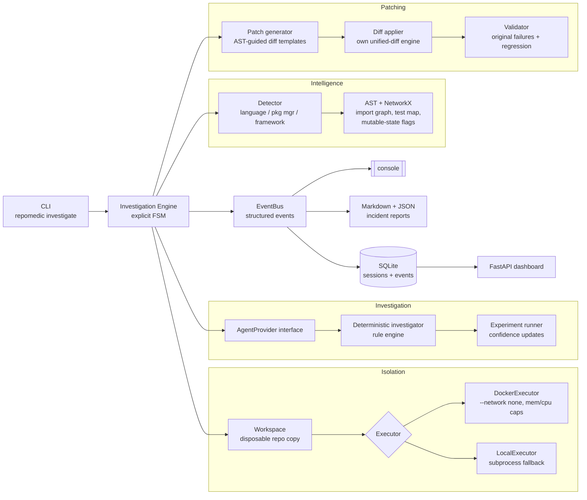
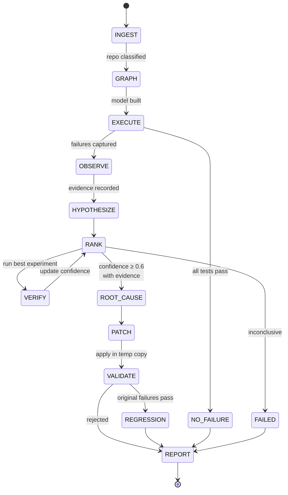

# RepoMedic 

**Autonomous repository failure investigation and patch verification.**

Point RepoMedic at a repository with failing tests. It builds an intelligence
model of the code, reproduces the failure in an isolated environment, runs a
hypothesis-driven investigation loop with real verification experiments,
selects an evidence-backed root cause, generates a minimal patch — and only
calls the patch a fix after re-running the original failures *and* the full
regression suite against a patched copy.

```bash
pip install -e . && repomedic investigate ./broken-repo
```

RepoMedic is built around two hard rules, enforced in code rather than by
convention:

> **A root cause is never claimed without recorded evidence.**
> **A patch is never marked successful unless validation commands actually ran and passed.**

No LLM is required: the bundled deterministic investigator reproduces the same
conclusions from the same repository every time, which makes the whole
pipeline unit-testable and CI-friendly. An LLM can be plugged in later behind
the `AgentProvider` interface without touching the engine.

---

## Demo (real output)

Investigating the bundled `fixtures/cache-bug` repository — a small cache
library whose tests fail intermittently because `MemoryCache._store` is a
class-level dict shared by every instance:

```console
$ repomedic investigate fixtures/cache-bug
[INGEST] Repository detected: Python / pytest
[GRAPH] 6 modules mapped
[EXECUTE] Running pytest
[FAILURE] 2 failing tests detected
[INVESTIGATE] Generated 1 hypotheses
[VERIFY] Testing hypothesis H1
[VERIFY] H1 confidence 0.40 -> 0.88
[ROOT_CAUSE] src/cache.py:15
[PATCH] Generated 3-line patch
[VALIDATE] Original failures: PASS
[REGRESSION] 7 tests: PASS
[REPORT] .repomedic/reports/session-001.md
```

And `fixtures/schema-mismatch` — a user service where a storage-layer refactor
renamed a dict key the API layer still consumes:

```console
$ repomedic investigate fixtures/schema-mismatch
[INGEST] Repository detected: Python / pytest
[GRAPH] 6 modules mapped
[EXECUTE] Running pytest
[FAILURE] 3 failing tests detected
[INVESTIGATE] Generated 1 hypotheses
[VERIFY] Testing hypothesis H1
[VERIFY] H1 confidence 0.45 -> 0.89
[ROOT_CAUSE] src/repository.py:18
[PATCH] Generated 2-line patch
[VALIDATE] Original failures: PASS
[REGRESSION] 6 tests: PASS
[REPORT] .repomedic/reports/session-001.md
```

Both transcripts above are unedited output of the current build (the same runs
execute in CI on every push).

---

## How it works

### Architecture



### Investigation lifecycle

Every run walks an explicit state machine — illegal transitions raise, every
transition emits a structured event, and `PATCH` is structurally unreachable
except through `ROOT_CAUSE`:



The OBSERVE → HYPOTHESIZE → RANK → VERIFY → update loop maintains multiple
root-cause hypotheses, each carrying a description, confidence score,
supporting/contradicting evidence ids, and a proposed verification
experiment. Two experiment shapes ship today:

- **Isolation re-run** — a test that failed in the full suite is re-run alone.
  Passing in isolation is the classic signature of cross-test shared state.
- **Producer probe** — for a `KeyError` whose missing key closely matches a
  key some producer function actually returns, the producer is called in the
  sandbox and its returned keys inspected.

Verdicts move confidence multiplicatively (`supports`: `c += (1−c)·0.8`,
`contradicts`: `c ×= 0.25`, rejection below 0.15) and every verdict is
recorded as evidence linked to the hypothesis.

### Example incident report

Every session produces a Markdown + JSON incident report. Abridged real output
from the cache-bug fixture (`.repomedic/reports/session-001.md`):

> ## Hypotheses considered
>
> ### H1 — shared_mutable_class_attr (confidence 0.88, status verified)
>
> class `MemoryCache` in src/cache.py shares mutable class attribute `_store`
> across all instances; state written by one test leaks into the next
>
> - **Suspect:** `src/cache.py:15` (`MemoryCache._store`)
> - **Prior:** 0.40
> - **Supporting evidence:** E5, E6
> - **Experiment:** run `tests/test_cache.py::test_new_cache_starts_empty`
>   alone: if it passes in isolation but failed in the full suite, cross-test
>   shared state is confirmed — verdict: `supports`
>
> ## Root cause
>
> **`src/cache.py:15`** — selected from hypothesis **H1** with confidence
> **0.88**, backed by evidence E5, E6.
>
> ## Patch
>
> ```diff
> --- a/src/cache.py
> +++ b/src/cache.py
> @@ -12,7 +12,8 @@
>
>  class MemoryCache:
> -    _store = {}
> +    def __init__(self):
> +        self._store = {}
>
>      def put(self, key, value):
>          self._store[key] = value
> ```
>
> ## Validation results
>
> - Original failing tests after patch: **PASS**
> - Full regression suite (7 tests): **PASS**
> - Verdict: **`accepted`**

The JSON twin contains the full session state (hypotheses, evidence, runs,
timeline) for programmatic consumption; the complete session also persists to
SQLite (`.repomedic/repomedic.db`) and is browsable with
`repomedic sessions`, `repomedic show session-001`, or the web dashboard
(`repomedic dashboard`).

---

## Installation & usage

```bash
python -m venv .venv && . .venv/bin/activate    # 3.11+
pip install -e ".[dev]"                          # dev extras: pytest, fastapi, ruff

repomedic investigate ./broken-repo              # auto: Docker if available
repomedic investigate ./broken-repo --executor local
repomedic sessions ./broken-repo                 # list stored sessions
repomedic show session-001 --repo ./broken-repo  # replay the event stream
repomedic dashboard --repo ./broken-repo         # minimal web UI (port 8787)
```

Exit code `0` means the investigation completed with an accepted, validated
patch (or the suite was already green); `1` means inconclusive or rejected —
useful in CI.

Run RepoMedic itself in Docker:

```bash
docker build -t repomedic .
docker run --rm -v /path/to/broken-repo:/target repomedic investigate /target --executor local
```

---

## Engineering decisions

- **Deterministic core, pluggable intelligence.** The investigation engine is
  decoupled from *what proposes hypotheses* via the `AgentProvider` interface
  (two methods: `generate_hypotheses`, `propose_patch`). The bundled provider
  is a deterministic rule engine, so the entire pipeline — including two full
  end-to-end fixture investigations — runs in CI with zero network access and
  zero flakiness. An LLM provider slots in without touching isolation,
  validation, or reporting.
- **Explicit FSM over implicit control flow.** The transition table is data;
  tests assert structural properties (e.g. `PATCH` is only reachable from
  `ROOT_CAUSE`). Investigations can't skip steps by accident.
- **Everything is a Pydantic model.** Sessions serialize losslessly to SQLite
  and JSON reports; the dashboard and CLI replay are free.
- **JUnit XML as the execution contract.** Stdout parsing is a fallback only.
  The same parser serves local and Docker executors, and structured
  `Failure`/`Frame` objects are what heuristics consume — no regex spaghetti
  downstream.
- **Own unified-diff engine.** Patches are applied by RepoMedic's own parser/
  applier (no `patch` binary, works on Windows). All hunks verify against
  context before any file is written, so a stale diff can't half-patch a tree.
- **Workspaces, not in-place mutation.** Every execution — including the
  initial reproduction — happens in a disposable copy. E2E tests assert every
  source file of the investigated repository is byte-identical afterwards;
  the only thing RepoMedic writes into the target is the `.repomedic/`
  directory (reports + session database).
- **Evidence graph before confidence.** Static findings, experiment verdicts
  and validation outcomes are first-class `Evidence` records referenced by id
  from hypotheses and the root cause. The report's claims are auditable.

## Safety & limitations

- **Executing untrusted code is inherently risky.** The Docker executor is
  the intended boundary: fresh container per command, `--network none`,
  memory/CPU/pid caps, non-root user. The local executor is a *convenience
  fallback* (temp copy, scrubbed environment, hard timeout) and provides **no
  security sandbox** — don't point it at repositories you don't trust.
- Experiments call repository code (e.g. the producer probe). They run only
  inside the executor sandbox, but with `--executor local` that still means
  your machine.
- Python/pytest only today (plus unittest detection). The detector reports
  other ecosystems as unsupported and exits cleanly with a report.
- The heuristic provider knows three defect families (mutable defaults,
  shared mutable class attributes, renamed-key schema mismatches) plus a
  fallback localizer. It will honestly conclude `FAILED` (inconclusive) on
  anything else rather than guess — by design.
- Patch templates fix the *producer* side of a schema mismatch (tests encode
  the contract). If your tests are wrong, the patch will be too — the report
  makes the reasoning explicit so a human can disagree.
- Test-order-dependent suites are assumed to run deterministically under
  plain `pytest`; random-order plugins will confuse the isolation experiment.

## Roadmap

- [ ] LLM-backed `AgentProvider` (hypotheses + patches from a model, same
      evidence/validation discipline)
- [ ] More heuristic families: off-by-one boundary analysis, dependency
      version drift, fixture misuse, flaky-test detection via repeated runs
- [ ] Bisect integration: correlate failures with recent commits (`git blame`
      evidence for hypotheses)
- [ ] JavaScript/TypeScript support (package.json / jest / vitest)
- [ ] Coverage-guided suspect ranking (run failing tests under `coverage.py`,
      intersect with the import graph)
- [ ] Patch candidates beam: generate N candidate patches, validate all,
      pick the minimal accepted one
- [ ] Richer dashboard: hypothesis timelines, diff viewer, report browser

## Project layout & docs

See [docs/architecture.md](docs/architecture.md) for the full subsystem
walkthrough, [docs/INTERVIEW.md](docs/INTERVIEW.md) for an honest Q&A about
design decisions and limitations, [CONTRIBUTING.md](CONTRIBUTING.md) for
development rules, and [fixtures/](fixtures/) for the intentionally broken
demo repositories.

```
make install   # editable install with dev extras
make test      # full suite minus docker-marked tests
make test-all  # everything (needs a Docker daemon)
make demo      # investigate both fixtures end-to-end
make lint      # ruff
```

## License

[MIT](LICENSE)
